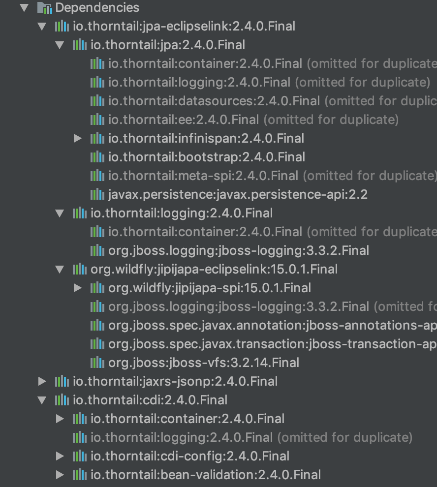

# 目的
thorntailお勉強のために作成。  
thorntailとはなんぞやという人は[ここ](https://www.publickey1.jp/blog/17/javamicroprofileeclipse.html)や[ここ](https://www.infoq.com/jp/news/2018/06/wildfly-thorntail)がおすすめ。

従業員管理サービスのマイクロサービスを実装する。  
throntailを導入してuberjarとしてKubernetes上で起動したい。

## ビルドツールやその他
ビルドツールをダウンロードしなくても済むのでGradle派だったが、thorntailはGradleだと色々不具合があり、Mavenで実装。  
Spring Boot(Spring BootはDell配下のPivotal開発て知ってました?)はJPAがHibernate標準だったり、REST API周りが独自実装であまり好きではないので、Java EEを適用可能なthorntailを実験中。
  
あと、SpringBoot使うとサーキットブレーカー等が使えるようですが、Istio使えば実装する必要なしです。  

# 使い方
## 1. MySQLの起動
データベースはMySQL on docker。
以下のコマンドを投入してdockerを起動。

1. Dockerfileが存在するディレクトリでdockerイメージをビルド。タグ名はnetapp/employeedb:v1だが他のものでも問題なし。
    ```
    $ docker build -t netapp/employeedb:v1 . 
    ```
2. イメージを元にビルド。
    * 以下はビルド時に永続ボリュームを指定していないので注意が必要です。
    * もし、コンテナを削除してテーブルデータが消えたら問題がある人は -v employeedb_volume:/var/lib/mysqlをオプションで投入するなりして永続ボリュームを適用しましょう。
    ```
    $ docker run -d --name employeedb -p 3306:3306 netapp/employeedb:v1
    ```
3. データの投入。※このデータの投入をそのまま実行してしまうとテーブルが作成されていないのでエラーになります。先に2.のthorntailのビルドと起動を実施してテーブルを自動で作成してください。 
    load.sqlをpersisntece.xmlに定義し、起動時にINSERT文を大量にロードする予定なので、本来は以下の処理は不要です。
    1. docker上のOSに入る。
        ```
        $ docker exec -it employeedb /bin/bash
        ```
    1. mysqlコマンドを叩いてMySQLにログイン
        ```
        $ mysql -u kenta -p
        kosugi
        ```
    1. employeedbにアタッチ
        ```
        mysql> use employeedb
        ```
    1. 適当なデータを入れてください。※必要なだけ
        ```
        mysql> insert into employee values('0347255', 'kenta', 'kosugi', null, null);
        ```
## 2. thorntailのビルドと起動
1. Mavenのpackageゴールを指定してwar/jarを作成
    ```
    $ mvn package
    ```
1. targetディレクトリに以下二つのjar/warが作成されることを確認。
    * target/employee.war
        * こちらがwarファイルのようです。試していませんが、Wildflyなどにデプロイすれば普通に動くのではないかと思います。
    * target/employee-thorntail.jar
        * こちらがuberjarと呼ばれるファイル。内部にthorntailを起動するためのBootStrapや起動に必要なjar群が固まって格納されています。
1. java コマンドを使用してjarファイルを起動。
    ```
    $ java -jar target/employee-thorntail.jar -s./project-defaults.yaml
    ```
## 3. REST APIへアクセス
1. VSCodeのREST Clientなどを使用して、REST APIにアクセス。
    ```
    GET http://localhost:8080/api/employee/hello
    ```
# 利用Fraction

|フラクション|役割|
|---|---|
|jaxrs-jsonp|JAX-RSとJSON-Pを使用する|
|jpa-eclipselink|JPAのEclipseLink実装を利用する|
|datasources|thorntail上からデータベースへのコネクションプールを張る|
|cdi|Dependency Injectionを利用する。|

認識しているのは上記だが、Mavenの依存関係自動解決で他にも色々適用されている様子。


# API 仕様(現時点)
```
http://localhost:8080/api/employee/hello
```

今はまだHello Worldレベル。
EMPLOYEEテーブルにあるすべての従業員を引っ張りだしてくる。    
thorntail起動マシン以外からアクセスするとクロスドメインの問題が発生すると思うので、[ここ](http://garapon.hatenablog.com/entry/2016/03/23/JAX-RS2.0でRESTサービスを作る際にヘッダーを指定する)の対策をしましょう
。

# テーブル
Code Firstで実装しているので、thorntailを起動すると勝手にテーブルを作成します。
```java
package org.kenta.kosugi.employee.model;

import javax.persistence.*;
import java.io.Serializable;

@Entity
@Table(name = "EMPLOYEE", indexes = {
        @Index(name = "IDX_FIRST_NAME", columnList = "FIRST_NAME"),
        @Index(name = "IDX_MIDDLE_NAME", columnList = "MIDDLE_NAME"),
        @Index(name = "IDX_LAST_NAME", columnList = "LAST_NAME")
})
@NamedQueries({
        @NamedQuery(name = "Employee.findAll", query = "select a from Employee a"),
        @NamedQuery(name = "Employee.findByName", query = "select a from Employee a where a.firstName like :name or a.lastName like :name")
})
public class Employee implements Serializable {

    private static final long serialVersionUID = -7763827188716065700L;

    @Id
    @Column(name = "ID", length = 8)
    public String id;

    @Column(name = "FIRST_NAME", length = 32)
    public String firstName;

    @Column(name = "MIDDLE_NAME", length = 32, nullable = true)
    public String middleName;

    @Column(name = "LAST_NAME", length = 32)
    public String lastName;

    @ManyToOne(cascade = CascadeType.ALL, fetch = FetchType.EAGER)
    public Employee boss;

}

```
これから自動生成されるテーブルのスキーマは以下。
```sql
create table EMPLOYEE
(
	ID varchar(8) not null
		primary key,
	FIRST_NAME varchar(32) null,
	LAST_NAME varchar(32) null,
	MIDDLE_NAME varchar(32) null,
	BOSS_ID varchar(8) null,
	constraint FK_EMPLOYEE_BOSS_ID
		foreign key (BOSS_ID) references EMPLOYEE (ID)
);

create index IDX_FIRST_NAME
	on EMPLOYEE (FIRST_NAME);

create index IDX_LAST_NAME
	on EMPLOYEE (LAST_NAME);

create index IDX_MIDDLE_NAME
	on EMPLOYEE (MIDDLE_NAME);
```

# 確認している問題
* MySQLのコネクタを8.xもしくは6.xの新し目のものにするとthorntailが起動しない。
* MavenではなくGradleを利用すると同じコードでも起動しない。packageゴールで色々問題が発生している？
* MySQLを依存関係に入れてthrontailを起動すると勝手にDataSourceとして認識する様子。
  * RESOURCE_LOCALは認識しない？